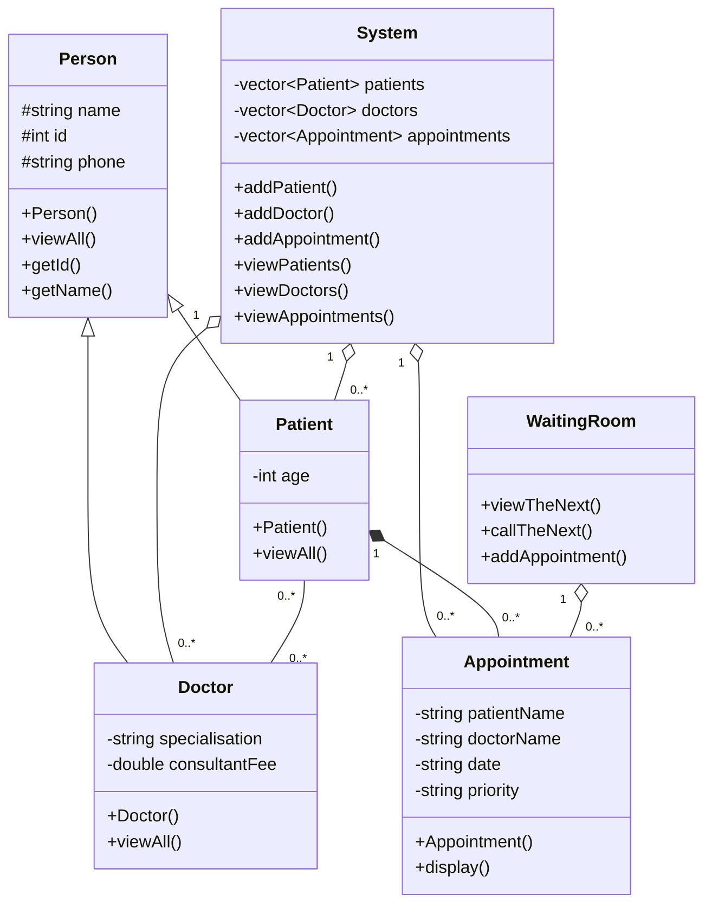

# Clinic-Management-System

```mermaid
classDiagram
    class Person {
        #string name
        #int id
        #string phone
        +Person()
        +viewAll()
        +getId()
        +getName()
    }

    class Patient {
        -int age
        +Patient()
        +viewAll()
    }

    class Doctor {
        -string specialisation
        -double consultantFee
        +Doctor()
        +viewAll()
    }

    class Appointment {
        -string patientName
        -string doctorName
        -string date
        -string priority
        +Appointment()
        +display()
    }

    class System {
        -vector~Patient~ patients
        -vector~Doctor~ doctors
        -vector~Appointment~ appointments
        +addPatient()
        +addDoctor()
        +addAppointment()
        +viewPatients()
        +viewDoctors()
        +viewAppointments()
    }

    class WaitingRoom {
    +viewTheNext()
    +callTheNext()
    +addAppointment()
    }

    Person <|-- Patient
    Person <|-- Doctor
    System "1" o-- "0..*" Patient
    System "1" o-- "0..*" Doctor
    System "1" o-- "0..*" Appointment
    Patient "0..*" -- "0..*" Doctor
    Patient "1" *-- "0..*" Appointment
    WaitingRoom "1" o-- "0..*" Appointment
```
