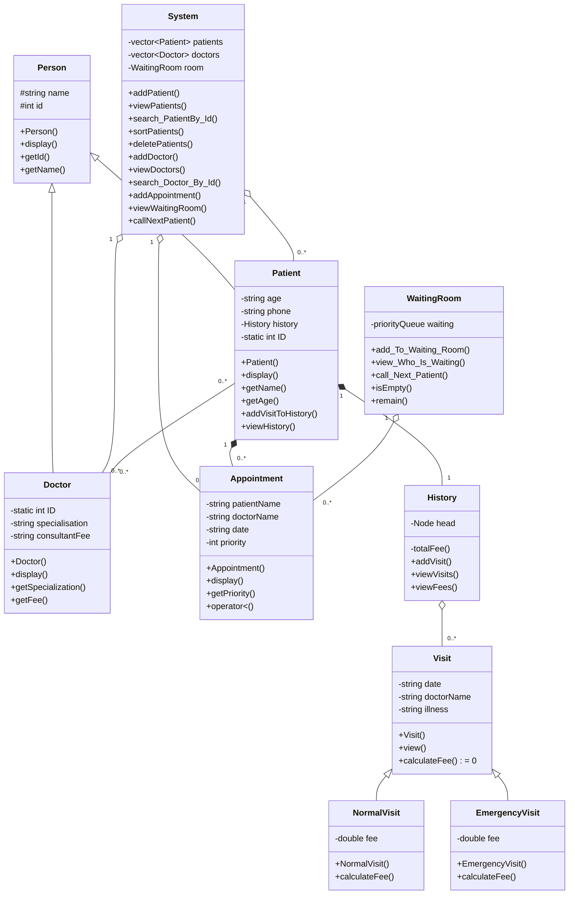

# Clinic-Management-System

```mermaid
classDiagram
    class Person {
        #string name
        #int id
        +Person()
        +display()
        +getId()
        +getName()
    }

    class Patient {
        -string age
        -string phone
        -History history
        -static int ID
        +Patient()
        +display()
        +getName()
        +getAge()
        +addVisitToHistory()
        +viewHistory()
    }

    class Doctor {
        -static int ID
        -string specialisation
        -string consultantFee
        +Doctor()
        +display()
        +getSpecialization()
        +getFee()
    }

    class Appointment {
        -string patientName
        -string doctorName
        -string date
        -int priority
        +Appointment()
        +display()
        +getPriority()
        +operator<()
    }

    class System {
        -vector~Patient~ patients
        -vector~Doctor~ doctors
        -WaitingRoom room
        +addPatient()
        +viewPatients()
        +search_PatientBy_Id()
        +sortPatients()
        +deletePatients()
        +addDoctor()
        +viewDoctors()
        +search_Doctor_By_Id()
        +addAppointment()
        +viewWaitingRoom()
        +callNextPatient()
    }

    class WaitingRoom {
        -priorityQueue waiting
	    +add_To_Waiting_Room()
        +view_Who_Is_Waiting()
	    +call_Next_Patient()
        +isEmpty()
	    +remain()
    }

    class History {
        -Node head
	    -totalFee()
	    +addVisit()
	    +viewVisits()
	    +viewFees()
    }

    class Visit {
        -string date
        -string doctorName
        -string illness
	    +Visit()
	    +view()
	    +calculateFee() = 0
    }
    class NormalVisit {
        -double fee
	    +NormalVisit()
	    +calculateFee()
    }

    class EmergencyVisit {
	    -double fee
	    +EmergencyVisit()
	    +calculateFee()
    }

    Person <|-- Patient
    Person <|-- Doctor
    System "1" o-- "0..*" Patient
    System "1" o-- "0..*" Doctor
    System "1" o-- "0..*" Appointment
    Patient "0..*" -- "0..*" Doctor
    Patient "1" *-- "0..*" Appointment
    WaitingRoom "1" o-- "0..*" Appointment
    Visit <|-- NormalVisit
    Visit <|-- EmergencyVisit
    History o-- "0..*" Visit
    Patient "1" *-- "1" History
```
